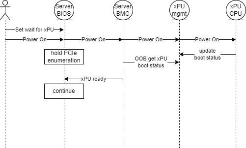

# Bootup coordination approaches

Reference [BOOTSEQ.md](./BOOTSEQ.md)

## TLDR

This page is taking assumptions and use cases from [BOOTSEQ.md](./BOOTSEQ.md) page and tries to deep dive on 3 possible solutions of the only initial bootup part.
Three possible solutions are either in-band via different PCIe mechanisms or option ROM (OROM) for UEFI / BIOS or OOB via BMC assisted mechanisms.
Initial bootup part covers: Server is Powered On, DPU receives power and starts booting, Host OS should wait for DPU to finish booting.

Coordinated shutdowns, reboots, crashes, error handling will be details on a separate page.

## Terms

see <https://github.com/opiproject/opi-prov-life/blob/main/BOOTSEQ.md#terms>

## Working Summary

We do not necessarily need to pick one option:

- Option 1 may be useful as a long-term architected in-band solution, especially with the DOE path (which does not require a PCIe spec change)
- Option 3 may be preferred by systems that prefer OOB management (BMC manages all devices directly). And it does not necessarily conflict with Option (1) for the in-band host/UEFI operation
- Option 2 may be a stop-gap, especially if it does not require a host (HW, BIOS or BMC) changes. But it is not guaranteed to work in all cases.

_This is still an **active** discussion at this point in time in this TWG._

## 1: In-band PCIe

In-Band refers to PCIe config access to the xPU from UEFI running on the server cores.

- **Pros:**
No OOB communication.
No changes required in server BMC.
- **Cons:**
Will require PCIe SIG adoption.
Will require changes in BIOS/UEFI.
No defacto standards in BIOS/UEFI <-> BMC communication.

### Assumption

Servers need to change their BIOS/UEFI implementation to accomodate for this option.

### Flow Diagram

### Details

1. All xPU devices shall have a standard PCI PF0 interface (PCI Physical Function 0) that is fully compliant to the PCIe specification
   - The PF0 interface shall be functional 3 seconds after PERST# is de-asserted
   - The PF0 interface shall be functional when the compute complex on the xPU is running, locked up or halted
1. Define a new PCI Class Code and corresponding PCI architected Extended Capability Structure for xPUs
   - Define PCI sub-classes for xPUs with and without an AMC
   - The PCI architected Extended Capability Structure shall include items 3-7 below
1. Define a read only PF0 OS_STATUS register with the following bits defined
   - Not started
   - Booting
   - Booted
   - Stalled or locked-up
   - Halted
1. Define a read only PF0 CRASHDUMP_STATUS register with the following bits defined
   - Not started
   - In progress
   - Complete
1. Define a read only PF0 MAX_BOOT_TIME register with a range from 0 to 1600 seconds
1. Define a read/write PF0 RESET register with individual bits to resets specific segments of the xPU
   - PCI interface
   - CPU complex
   - AMC
   - Accelerator1
   - Accelerator2
   - other

**Optional possible addition to consider:**

1. Define a read/write PF0 OS_BOOT_SELECT register with the following bits defined
   - Network OS boot (bit only - does not include the actual path and credentials)
   - OS on xPU’s non-volatile storage
   - UEFI on xPU’s non-volatile storage
   - Maintenance OS/FW on xPU’s non-volatile storage
   - Other

### DOE Improvement

We could define a new DOE object (which we can do using our own specification with a GUID, without having to go to PCI-SIG).
The DOE object can then be formatted to include multiple fields (and versioned/extensible for the future if needed).
These fields can include OS_STATUS, CRASHDUMP_STATUS, etc.. registers described above.
DOE allows for bi-directional MMIO communication, so we could also have write fields.
For more information, refer to the DOE PCIe ECN here: <https://members.pcisig.com/wg/PCI-SIG/document/18483?uploaded=1>.
For adapters that already support DOE hardware (for other features, such as PCIe IDE/CMA, etc..), adding support for a new feature using the same DOE hardware may just require a firmware change (_to be confirmed_).

## 2: Driver Ready Check

The race condition to consider is when the Host is first to boot before the infrastrastructure is ready to serve to the Host its boot image (from a port or a disk hanging off the infrastructure device (DPU/IPU)).  To ensure that the port / disk is ready to be used by the Host, the driver running in the UEFI / BIOS should check that the infrastructure is ready before trying to PXE boot or to read the boot disk.
Infrastructure devices acting as either a Host peripheral or as an independent entity will benefit from this 'ready' check. This ready check enables the common case of shared power across DPU/IPU and server(s), and enables parallel startup of the DPU/IPU and attached host(s) once shared power is applied.

### Assumptions

- The infrastructure devices must follow the PCI spec and be ready on the bus(es)
at enumeration time, and/or hot plug devices in and out dynamically.
- Drivers for both X86 and ARM have to be present at the same time in option ROM (OROM).
  - xPUs running on Arm-based servers are required to use AARCH64 native UEFI Drivers (see the UEFI driver requirements in section 7.3.3.1 of [Arm BBR specification](https://developer.arm.com/documentation/den0044/latest)

### UEFI boot flow

UEFI specification section of how PCI Option ROMs are "loaded" from the device into memory, then started later on with driver "connect": <https://uefi.org/specs/UEFI/2.10/14_Protocols_PCI_Bus_Support.html?highlight=option%20rom#pci-bus-driver-responsibilities>

### Virtio-net

The virtio-net device presents its driver in an option ROM (OROM) for UEFI / BIOS.  This driver will stall the PXE boot process until the infrastructure backend is ready (via a driver specific signaling).

### Virtio-blk

The virtio-blk device presents its driver in an option ROM (OROM) for UEFI / BIOS.  This driver will stall the requests on the disk until the infrastructure backend is ready (via a driver specific signaling).

### NVMe

The NVMe device driver will poll the CSTS.rdy bit to ensure that infrastructure backend is ready before reading or writing.

### idpf (Infrastructure Data Plane Function)

The idpf device will come up with the link down, and will notify the driver
that it is ready by bringing the link up.  The driver will wait to send on
the device until the link is brought up.

### Improvement

This option can be improved by using a contract/handshake, similar to the UEFI specification method for detecting Adapter Information, such as the Media presence (or other attributes that can be dynamic).
See UEFI spec: <https://uefi.org/specs/UEFI/2.10/11_Protocols_UEFI_Driver_Model.html?highlight=adapter_info_#network-media-state>.
This is already supported by many network adapters and UEFI/BIOS implementations.
This removes the need to rely on delay in the driver/OptionROM implementation, and instead gives the control to the BIOS/UEFI to detect when the xPU is ready.
This however does NOT address the issues with xPU initialization taking too long that the PCI OptionROM itself does not get loaded in time when the host needs it.

### Summary

- **Pros:** No assumptions or changes required on the host, including BIOS.
Infrastructure devices can be used to provision the host(s) they
are running inside, either in a single server or in a server with multiple
independent host complexes. Devices presented can be standards based
and/or software defined. Not dependent on changes in other standards
bodies or specs outside of OPI.
- **Cons:** The infrastructure device needs to follow the PCI spec, including
meeting the timing constraints around enumeration.  Dynamic adding and
deleting devices on the PCI bus via hot plug requires BIOS configuration.

## 3: Out-band via platform BMC

- **Pros:**
No timing issues with PCIe.
Many standards to choose from for xPU <-> server BMC communication.
- **Cons:**
Will require changes in server BMC.
Will require changes in BIOS/UEFI.
No defacto standards in BIOS/UEFI <-> BMC communication.

### Diagram

### PLDM State sensors - PLDM

Note: PLDM is over MTCP which can be caried over I2C, I3C, PCIe VDM, serial, USB and other physical connections

Useful State definitions

| Set ID 129 Software Termination Status        | Status related to firmware of the operating system.                   | Notes/Usage |
| :-----                                        | :-----                                                                | :-----      |
| 0 – Unknown                                   | Unknown                                                               |             |
| 1 – Normal                                    | Software termination is not detected.                                 |             |
| 2 – Software Termination Detected             | Software termination is detected.                                     |             |
| 3 – Critical Stop during  Load/Initialization | The software entity failed during loading or initialization.          |             |
| 4 – Run-time Critical Stop                    | The software entity incurred a run-time failure.                      |             |
| 5 – Graceful Shutdown Requested               | The software entity has been requested to shut down gracefully.       |             |
| 6 – Graceful Restart Requested                | The software entity has been requested to restart gracefully.         |             |
| 7 – Graceful Shutdown                         | The software entity has been shut down gracefully.                    |  Delayed power off.  Wait for xPU to halt before removing power           |
| 8 – Termination Request Failed                | The request to terminate the execution of the software entity failed. |             |

| Set ID 192 Boot/Restart Cause | Represents the stimulus that booted the entity.                                                                                                                                                | Notes/Usage |
| :-----                        | :-----                                                                                                                                                                                         | :-----      |
| 0 – Unknown                   | Unknown                                                                                                                                                                                        |             |
| 1 – Powered Up                | A start of the system is initiated by changing the entity’s state from  powered off to powered on.                                                                                             |             |
| 2 – Hard Reset                | A restart of the system is accomplished by activating the entity’s reset circuitry.                                                                                                            |             |
| 3 – Warm Reset                | A restart of the system is performed by software that does not involve powering the system off or activating the entity’s reset circuitry.                                                     |             |
| 4 – Manual Hard Reset         | A restart is initiated by the user activation of a mechanical device (for example, pressing a button) and bypasses runtime software.                                                           |             |
| 5 – Manual Warm Reset         | A restart is initiated by the user activation of a mechanical device (for example, pressing a button) and does not involve powering the entity off or activating the system’s reset circuitry. |             |
| 6 – System Restart            | A restart of the entity is initiated by entity hardware components and accomplished by activating the system’s reset circuitry.                                                                |             |
| 7 – Watchdog Timeout          | A restart of the entity is initiated in response to a detected system hang condition.                                                                                                          |             |

| Set ID 196 Boot Progress                                                   | System firmware or software booting status.                                               | Notes/Usage                          |
| :------------------------                                                  | :-------------                                                                            | :-------                             |
| 0 - Unknown                                                                | Unknonwn, not a defined value                                                             | Initial state before UEFI is entered |
| 1 ... 5 (Not Used)                                                         | Not Used                                                                                  |                                      |
| 6 – User Authentication                                                    | The boot process is processing the user authentication.                                   |                                      |
| 7 – User-Initiated System Setup                                            | System firmware or BIOS has entered the user system firmware or BIOS configuration setup. |                                      |
| 8 ... 20 (Not Used)                                                        | Not Used                                                                                  |                                      |
| 21 – Starting Operating System Boot Process (for example, calling INT 19h) | The system firmware or BIOS is booting the operating system.                              | Marks transition from UEFI to OS     |
| 22 ... 26 (Not Used)                                                       | Not Used                                                                                  |                                      |

Reference:

- <https://www.dmtf.org/dsp/DSP0249> DMTF DSP0249 State Set Specification
- <https://www.dmtf.org/dsp/DSP0248> DMTF DSP0248 PLDM for Platform Monitoring and Control Specification

### PLDM RDE

Reference:

- <https://www.dmtf.org/dsp/DSP0218> DMTF DSP0218 PLDM for Redfish Device Enablement

### SPDM

SPDM runs over MTCP/I2C, PCIe DOE, and potentially MTCP/USB.  Not that some physical layers do not support Asyncronus Event Notifications (AEN).  SPDM is initiated by the platform BMC to the xPU.

The platform BMC can use SPDM to get a device certificate or alias certificate from an xPU and challenge that xPU to verify it has the associated private key.  If the platform BMC supports mutual authentication, the xPU can get a device certificate for the platform BMC and challenge it.  The use case for SPDM is not clear.  It makes sense for the platform BMC to validate the xPU if the platform BMC is considered the primary Root of Trust (ROT).  If the xPU is an independent or primary ROT it may not make sense to have the platform BMC validate it.  Also note that verification of authenticity requires a trust store of CA certs to be kept on the device doing the verification.

If mutual authentication is supported it may make sense to privilage some operations from platform BMC to XPU for example NMI, reset or graceful shutdown requests.

Using an SPDM encrypted session might be a good way share credentials between the xPU and the platform BMC to be used for protocols that require credentials (i.e. Redfish).

Reference:

- <https://www.dmtf.org/dsp/DSP0274> DMTF DSP0274 Security Protocol and Data Model (SPDM) Specification

### I2C

I2C on it's own is not useful unless there is a protocol defined.  

### NC-SI OEM

NC-SI 1.2 draft has no standard equivilant of the PLDM State Set Specification so OEM specific extensions would be required.

### USB

Could use PLDM State Sensor over PLDM over MTCP over USB
Reference:

- <https://www.dmtf.org/sites/default/files/standards/documents/DSP0283_0.1.5WIP10.pdf> (WIP) DMTF MCTP over USB Binding Specification

USB2 implies future products that will plug into PCIe CEM 6 which supports USB2 signals. This is necessary as a high speed OOB interface for supporting large files associated with FW/SW upgrade and audit logs.

- USB2 accesses from the BMC may terminate at an ASIC, FPGA, or AMC on the xPU.
- The xPU shall provide OOB abstracted protocol access (eg. PLDM) to the registers described in the IB section with PCI architected Extended Capability Structure
- The xPU shall start responding to requests from the BMC within 3 seconds after 12V is applied to the xPU

### others

## 4: Out-of-band xPU BMC

tbd
