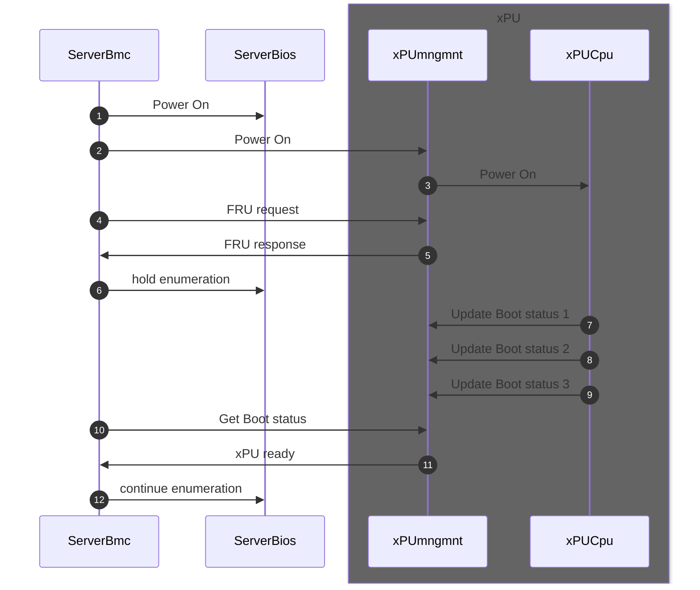

# PLDM State sensors

This page is work in progress, aggregating all the information we have so far with all the proposals.
We are iterating on this with pull requests until reaching final state.
Once finilized, we are taking this proposal to DMTF PLDM cometee.

## Diagram

from [here](boot/COORDINATION.md#diagram)

## Reference

- <https://www.dmtf.org/dsp/DSP0249> DMTF DSP0249 State Set Specification
- <https://www.dmtf.org/dsp/DSP0248> DMTF DSP0248 PLDM for Platform Monitoring and Control Specification

## Exisitng PLDM State sensors

from [here](boot/COORDINATION.md#pldm-state-sensors---pldm)

Useful State definitions:

- 129 Software Termination Status
- 192 Boot/Restart Cause
- 196 Boot Progress

### 129 Software Termination Status

| Set ID 129 Software Termination Status        | Status related to firmware of the operating system.                   | Notes/Usage |
| :-----                                        | :-----                                                                | :-----      |
| 0 – Unknown                                   | Unknown                                                               |             |
| 1 – Normal                                    | Software termination is not detected.                                 |             |
| 2 – Software Termination Detected             | Software termination is detected.                                     |             |
| 3 – Critical Stop during  Load/Initialization | The software entity failed during loading or initialization.          |             |
| 4 – Run-time Critical Stop                    | The software entity incurred a run-time failure.                      |             |
| 5 – Graceful Shutdown Requested               | The software entity has been requested to shut down gracefully.       |             |
| 6 – Graceful Restart Requested                | The software entity has been requested to restart gracefully.         |             |
| 7 – Graceful Shutdown                         | The software entity has been shut down gracefully.                    |  Delayed power off.  Wait for xPU to halt before removing power           |
| 8 – Termination Request Failed                | The request to terminate the execution of the software entity failed. |             |

### 192 Boot/Restart Cause

| Set ID 192 Boot/Restart Cause | Represents the stimulus that booted the entity.                                                                                                                                                | Notes/Usage |
| :-----                        | :-----                                                                                                                                                                                         | :-----      |
| 0 – Unknown                   | Unknown                                                                                                                                                                                        |             |
| 1 – Powered Up                | A start of the system is initiated by changing the entity’s state from  powered off to powered on.                                                                                             |             |
| 2 – Hard Reset                | A restart of the system is accomplished by activating the entity’s reset circuitry.                                                                                                            |             |
| 3 – Warm Reset                | A restart of the system is performed by software that does not involve powering the system off or activating the entity’s reset circuitry.                                                     |             |
| 4 – Manual Hard Reset         | A restart is initiated by the user activation of a mechanical device (for example, pressing a button) and bypasses runtime software.                                                           |             |
| 5 – Manual Warm Reset         | A restart is initiated by the user activation of a mechanical device (for example, pressing a button) and does not involve powering the entity off or activating the system’s reset circuitry. |             |
| 6 – System Restart            | A restart of the entity is initiated by entity hardware components and accomplished by activating the system’s reset circuitry.                                                                |             |
| 7 – Watchdog Timeout          | A restart of the entity is initiated in response to a detected system hang condition.                                                                                                          |             |

### 196 Boot Progress

| Set ID 196 Boot Progress                                                   | System firmware or software booting status.                                               | Notes/Usage                          |
| :------------------------                                                  | :-------------                                                                            | :-------                             |
| 0 - Unknown                                                                | Unknonwn, not a defined value                                                             | Initial state before UEFI is entered |
| 1 ... 5 (Not Used)                                                         | Not Used                                                                                  |                                      |
| 6 – User Authentication                                                    | The boot process is processing the user authentication.                                   |                                      |
| 7 – User-Initiated System Setup                                            | System firmware or BIOS has entered the user system firmware or BIOS configuration setup. |                                      |
| 8 ... 20 (Not Used)                                                        | Not Used                                                                                  |                                      |
| 21 – Starting Operating System Boot Process (for example, calling INT 19h) | The system firmware or BIOS is booting the operating system.                              | Marks transition from UEFI to OS     |
| 22 ... 26 (Not Used)                                                       | Not Used                                                                                  |                                      |

## Dell NC-SI implementation

from <https://github.com/opiproject/opi-prov-life/blob/main/architecture/Dell%20NC-SI%20OEM%20Commands%20for%20smartNICs.pdf>

The following table defines the SN State values
| Value | Name | Description |
| :-----| :----| :-----------|
| 0 | Reset | CPU is in reset / Boot ROM
| 1 | Firmware #1 | CPU has passed FW checkpoint 1
| 2 | Firmware #2 | CPU has passed FW checkpoint 2
| 3 | UEFI | CPU has entered UEFI
| 4 | OS Booting | CPU has entered OS
| 5 | OS Running | OS is running
| 6 | OS Halted/Shutdown | OS is halted or shutdown
| 7 | Updating | Update in Progress
| 8 | OS Crash Progressing | OS Crash Dump in progress
| 9 | OS Crash Complete | OS Crash Dump complete
| Other | Reserved | Reserved

## Nvidia proposal to extend 196 Boot Progress

from [here](https://opi-project.slack.com/archives/C0342L6T7EC/p1693938501126579)

| Set ID 196 Boot Progress                                                   | System firmware or software booting status.                                               | Notes/Usage                          |
| :------------------------                                                  | :-------------                                                                            | :-------                             |
| 0 - Reset/Boot-ROM    | The device has just been powered on or reset, and it's initializing basic hardware and loading the first firmware mutable FW components. |
| 1 - Boot stage 1      | FMC (First Mutable Code) is running. |
| 2 - Boot stage 2      | The device has progressed further in the boot process, executing additional instructions to load pre-OS SW. |
| 3 - UEFI              | The device is transitioning into the Unified Extensible Firmware Interface (UEFI) environment. |
| 4 - OS starting       | The operating system (OS) is being loaded and initialized on the device. |
| 5 - OS is running     | The operating system has successfully started and is now running normal operations. |
| 6 - Low-Power standby | The device has entered a low-power standby mode or is placed into idle state, conserving energy while remaining operational. |
| 7 - Firmware update in progress      | The device's firmware is being updated with new image. |
| 8 - OS Crash Dump in progress        | The operating system is in the process of capturing diagnostic information about an OS crash or error that has occurred. |
| 9 - OS Crash Dump is complete        | The operating system has concluded recording a crash dump. |
| 10 - FW Fault Crash Dump in progress | The device's firmware is collecting diagnostic data related to a FW fault or error in its operation. |
| 11 - FW Fault Crash Dump is complete | The firmware has finished collecting diagnostic data about a fault. |

For each state we want to define a "state result", which basically explains what we can expect after each state is done, I will take it internally and come with a proposal but feel free to do the same.

Each vendor should go over the list, see how it fits into his current flow and if there are new states which are needed or states that are unnecessary.

On top of the states we want to try and create a document in PLDM describing "how should a xPU be managed with PLDM".
