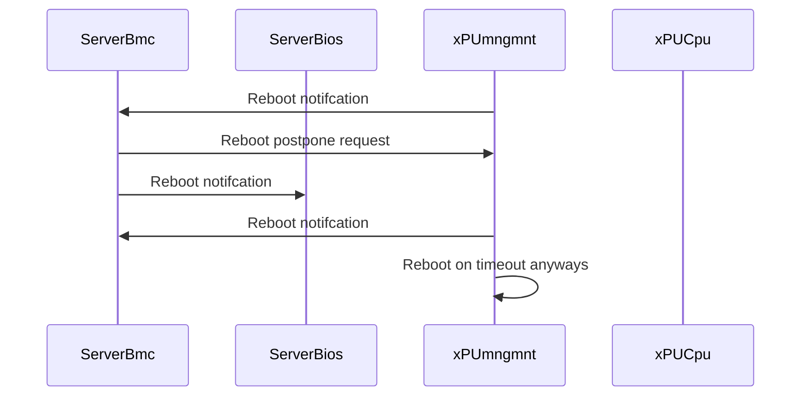

# DPU and Host reboot coordination approaches

Reference [BOOTSEQ.md](../BOOTSEQ.md)

## TLDR

This page is taking assumptions and use cases from [BOOTSEQ.md](../BOOTSEQ.md) page and tries to deep dive on possible solutions of the only DPU and Host reboots parts.

Initial bootup part covered [COORDINATION.md](./COORDINATION.md): Server is Powered On, DPU receives power and starts booting, Host OS should wait for DPU to finish booting.

## Terms

see <https://github.com/opiproject/opi-prov-life/blob/main/BOOTSEQ.md#terms>

## 1: DPU reboots

When DPU reboots we want to notify Host (either OS or BMC) about this fact.

### Why

* Host can yank DPU power if Host is not aware that DPU is rebooting
* Host can use the notification to migrate workloads to another host or to another DPU in the same host, while DPU is rebooting
* Host can apply some kind of "protection" to prevent DPC crushing the Host OS (surprise removal doesn't work well in NICs)
* Host can allow DPU to collect core dump
* Host can stay alive or gracefully reboot once DPU is rebooted

### What

* DPU should notify to Host that is is about to reboot
* In a trusted environment Host can ask for extension
* DPU will reboot itself anyways after timeout/wd expires

### How

* Out-band via platform BMC: maybe using techiniques from [BOOTSEQ.md](../BOOTSEQ.md)
* In-Band TBD: maybe PCIe, IRQ, ...

### OOB Diagram

## 2: Host reboots

When Host reboots we want to notify DPU about this fact.

* Host can choose to reboot in different ways (shell, ipmi)
* Maybe we can use somehow PCIe PERST signal to notify DPU that host reboots
* DPU would like to free some resources/context assoiciated with that Host
* DPU can re-provision it for next Tenant on reboot
* DPU can deny/prevent from Host reboot
* How DPU reaction changes if it is installed in a slot providing persistent power, implying it should be independent of host?
* TBD

### Function Level Reset

Resets in PCI express are a bit complex. There are two main types of resets - conventional reset, and function-level reset. There are also two types of conventional resets, fundamental resets and non-fundamental resets. See the PCI express specification for all of the details.

* A `cold reset` is a fundamental reset that takes place after power is applied to a PCIe device. There appears to be no standard way of triggering a cold reset, save for turning the system off and back on again. On my machines, the `/sys/bus/pci/slots` directory is empty.
* A `warm reset` is a fundamental reset that is triggered without disconnecting power from the device. There appears to be no standard way of triggering a warm reset.
* A `hot reset` is a conventional reset that is triggered across a PCI express link. A hot reset is triggered either when a link is forced into electrical idle or by sending TS1 and TS2 ordered sets with the hot reset bit set. Software can initiate a hot reset by setting and then clearing the secondary bus reset bit in the bridge control register in the PCI configuration space of the bridge port upstream of the device.
* A `function-level reset` (FLR) is a reset that affects only a single function of a PCI express device. It must not reset the entire PCIe device. Implementing function-level resets is not required by the PCIe specification. A function-level reset is initiated by setting the initiate function-level reset bit in the function's device control register in the PCI express capability structure in the PCI configuration space.

Linux exposes the function-level reset functionality in the form of `/sys/bus/pci/devices/$dev/reset`. Writing a 1 to this file will initiate a function-level reset on the corresponding function. Note that this only affects that specific function of the device, not the whole device, and devices are not required to implement function-level resets as per the PCIe specification.
