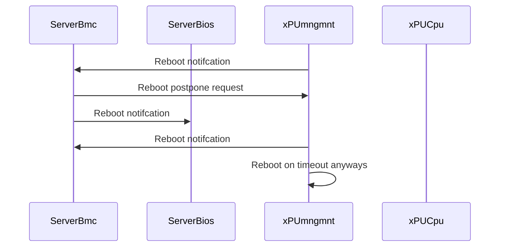

# DPU and Host reboot coordination approaches

Reference [BOOTSEQ.md](./README.md)

## TLDR

This page is taking assumptions and use cases from [BOOTSEQ.md](../BOOTSEQ.md) page and tries to deep dive on possible solutions of the only DPU and Host reboots parts.

Initial bootup part covered [COORDINATION.md](./COORDINATION.md): Server is Powered On, DPU receives power and starts booting, Host OS should wait for DPU to finish booting.

## Current Status

After months of discussion on the topic of boot and reboot coordination, the OPI Lifecycle working group has reached a point of consensus that we agree on a general future path, but we also recognize that path is off in the future requiring standards to be developed which are outside of the OPI Lifecycle working group.

The underlying challenge in coordination between devices, is that in a model of a system inside of a system, there is a dependency on power from the Host System, and there is a possible dependency on the xPU in order to boot the Host System. Similarly, with reboots, the Host system may reboot independently, and that should not impact the xPU’s operation, except when it is the xPU which requires a reboot, the things rapidly grow further complicated.

Overall, the The resulting community consensus is that it is the responsibility of the Baseboard Management Controller, working in concert with system firmware to hold the boot sequence until the xPU is operational. The underlying challenge is the mechanics. Powering on the overall host is relatively simple, but navigating an online xPU reboot is the difficult path

The underlying problem is the underlying mechanism for communication available to us *today* in a means which we can ensure we are communicating with the device(s) inside of the physical machine. Discussions have centered around the use of the I2C bus as the transport mechanism between the overall host BMC and the xPU, where PLDM based data models could be used to understand the state of the xPU, and then proceed with a boot operation once in a ready state to proceed. We’re sure enough about this as an approach as being a step forward, that we’re starting to engage the DMTF PLDM working group regarding the data model and available objects, because xPUs are far more advanced than just Network Adapters.

The challenge in any flow, specifically after initial startup, is what happens when devices reboot.

A defensively coded application stack running on an xPU should expect to be able to handle a soft reset of the Host System.

The bigger challenge is if the xPU needs to be rebooted, and ultimately what that looks like because the Host System is dependent upon the state and applications running on the xPU.

This is where the discussion begins to go sideways. The challenge being rooted in the I2C bus, and the fact that there is no means for the xPU to directly signal to the Host System BMC that a reboot has been requested. This is rooted in the fact that the I2C bus design is one such that the client (Host System BMC) multiplexes requests across multiple devices (including any xPUs), and signaling wise there is just no reverse path. The resulting need for server/chassis hardware vendors is to embed logic inside of their BMCs to poll the devices over I2C, and respond based upon the state data provided by PLDM. However, long running continuous polling processes are not acceptable to some hardware vendors, where others are entirely comfortable with such implementations and logic executing continuously inside of their BMCs.

Consensus on a forward path has centered around the use of MCTP over USB, however this is not yet a standardized substrate available to us yet as it is still under discussion and standardization to a point where bi-directional communication will be available between the xPU and the Host System BMC.

## Terms

see <https://github.com/opiproject/opi-prov-life/blob/main/BOOTSEQ.md#terms>

## 1: DPU reboots

When DPU reboots we want to notify Host (either OS or BMC) about this fact.

### Why

* Host can yank DPU power if Host is not aware that DPU is rebooting
* Host can use the notification to migrate workloads to another host or to another DPU in the same host, while DPU is rebooting
* Host can apply some kind of "protection" to prevent DPC crushing the Host OS (surprise removal doesn't work well in NICs)
* Host can allow DPU to collect core dump
* Host can stay alive or gracefully reboot once DPU is rebooted

### What

* DPU should notify to Host that is is about to reboot
* In a trusted environment Host can ask for extension
* DPU will reboot itself anyways after timeout/wd expires

### How

* Out-band via platform BMC: maybe using techiniques from [BOOTSEQ.md](../BOOTSEQ.md)
* In-Band TBD: maybe PCIe, IRQ, ...

### OOB Diagram

## 2: Host reboots

When Host reboots we want to notify DPU about this fact.

* Host can choose to reboot in different ways (shell, ipmi)
* Maybe we can use somehow PCIe PERST signal to notify DPU that host reboots
* DPU would like to free some resources/context assoiciated with that Host
* DPU can re-provision it for next Tenant on reboot
* DPU can deny/prevent from Host reboot
* How DPU reaction changes if it is installed in a slot providing persistent power, implying it should be independent of host?
* TBD

### Function Level Reset

Resets in PCI express are a bit complex. There are two main types of resets - conventional reset, and function-level reset. There are also two types of conventional resets, fundamental resets and non-fundamental resets. See the PCI express specification for all of the details.

* A `cold reset` is a fundamental reset that takes place after power is applied to a PCIe device. There appears to be no standard way of triggering a cold reset, save for turning the system off and back on again. On my machines, the `/sys/bus/pci/slots` directory is empty.
* A `warm reset` is a fundamental reset that is triggered without disconnecting power from the device. There appears to be no standard way of triggering a warm reset.
* A `hot reset` is a conventional reset that is triggered across a PCI express link. A hot reset is triggered either when a link is forced into electrical idle or by sending TS1 and TS2 ordered sets with the hot reset bit set. Software can initiate a hot reset by setting and then clearing the secondary bus reset bit in the bridge control register in the PCI configuration space of the bridge port upstream of the device.
* A `function-level reset` (FLR) is a reset that affects only a single function of a PCI express device. It must not reset the entire PCIe device. Implementing function-level resets is not required by the PCIe specification. A function-level reset is initiated by setting the initiate function-level reset bit in the function's device control register in the PCI express capability structure in the PCI configuration space.

Linux exposes the function-level reset functionality in the form of `/sys/bus/pci/devices/$dev/reset`. Writing a 1 to this file will initiate a function-level reset on the corresponding function. Note that this only affects that specific function of the device, not the whole device, and devices are not required to implement function-level resets as per the PCIe specification.

## Further ceboot-related cases

### Host OS Shutdown with an xPU

Discussion has centered around the host BMC intercepting any ACPI S5 command, and then the BMC will then be responsible for signaling to the xPU that the host is shutting down, and that the xPU should thus shut down as the device is likely going to lose power.

It would then be the responsibility of the BMC, once the xPU is ready, to proceed with removing
Host power.

This will likely require additional work with the DMTF PLDM working group.

### Host OS Reboot with an xPU

We anticipate that a host platform would assert a PCIe reset to the xPU device while system power remains. We anticipate no change being necessary to platforms for this case to be supported.

### Multiple xPUs in use for HA

We recognize this is a use case, which is largely outside of the realm of lifecycle management, however it might impact boot/reboot sequencing.

Host system operating systems will likely need to be active participants in the leveraging of this, unless there are services which are expected to be provided by the xPU.

Inter xPU communication/synchronization is largely out of scope of a lifecycle operation, and largely in the realm of the use case and application workload on such devices in concert with the Host System operating system.

### xPU Initiated Host OS Reboot

At present, we need to clarify this requirement, in large part because this can also be considered undesirable.

In the current context, the perception is that a BMC polling the state via PLDM, could then detect if a specific, to be determined flag has been set, at which point the BMC could then take some sort of process. This could be an ACPI command to request a reboot to the overall Host System.

Another possibility is the use of PCIe AER, where one could be issued by the xPU device, and an OS driver could then  handle the necessary action to trigger host reboot. This is not a preferred possibility, in large part because it would require kernel driver level code to achieve.

### xPU Initiated PCIe device hot-removal / offline

This item needs clarification of if this is a requirement for the use case.

A possible path, and known constraints:

* PCIe DPC with PCIe hot-removal works for NVMe. However, PCIe hot-removal for NIC cards does not work today.
* xPU will generate a device error status to its Host OS NIC driver, suspending/offline the NIC.  This is a vendor-specific method.

### xPU Firmware Update without disturbing the Host OS

There is an item in future discussion.

Initial discussion did lean into this is a “must have” for some, however this is also rooted in “what is viewed as firmware”, because if the OS itself on the xPU is considered part of this as a bulk update operation, it could also quickly violate constraints regarding secure boot because the underlying byte code would change if hot patched. Even if integrated circuits support embedded hot patching operations, they would fail firmware checksum attestation operations, so there is a trade-off between capability and security which would need to be determined, and likely that is driven from marketplace (customer) requirements.

Ultimately, a reboot would be required to ensure the trust has been maintained throughout the sequence of events.
