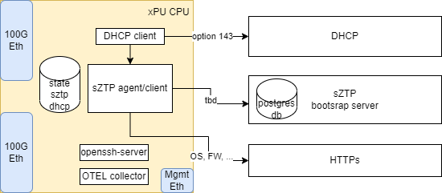

# sZTP and DHCP adn HTTP

## Docs

* <https://www.rfc-editor.org/rfc/pdfrfc/rfc8572.txt.pdf> (Secure Zero Touch Provisioning (SZTP))
* <https://watsen.net/docs/sztpd/0.0.11/admin-guide/#simulator>

## sZTP Diagram


## sZTP on DPU Diagram



## Run sZTP

```text
docker-compose up --build bootstrap
```

## Test sZTP

Fetching Host-meta

```text
$ docker-compose run agent curl -i --fail -H Accept:application/yang-data+json http://bootstrap:1080/.well-known/host-meta
HTTP/1.1 200 OK
Content-Type: application/xrd+xml; charset=utf-8
Content-Length: 104
Date: Wed, 17 Aug 2022 00:29:54 GMT
Server: <redacted>

<XRD xmlns="http://docs.oasis-open.org/ns/xri/xrd-1.0">
  <Link rel="restconf" href="/restconf"/>
</XRD>
```

Fetching the RESTCONF Root Resource

```text
$ docker-compose run agent curl -i --fail -H Accept:application/yang-data+json http://bootstrap:1080/restconf/
HTTP/1.1 200 OK
Content-Type: application/yang-data+json; charset=utf-8
Content-Length: 137
Date: Wed, 17 Aug 2022 00:30:32 GMT
Server: <redacted>

{
    "ietf-restconf:restconf" : {
        "data" : {},
        "operations" : {},
        "yang-library-version" : "2019-01-04"
    }
}
```

Get the Current (Default) Configuration

```text
$ docker-compose run agent curl -i -H "Accept:application/yang-data+json" http://bootstrap:1080/restconf/ds/ietf-datastores:running
HTTP/1.1 200 OK
Content-Type: application/yang-data+json; charset=utf-8
Content-Length: 318
Date: Wed, 17 Aug 2022 00:24:47 GMT
Server: <redacted>

{
  "wn-sztpd-1:transport": {
    "listen": {
      "endpoint": [
        {
          "name": "default startup endpoint",
          "use-for": "native-interface",
          "http": {
            "tcp-server-parameters": {
              "local-address": "0.0.0.0"
            }
          }
        }
      ]
    }
  }
}
```

## Device Getting Onboarding Information

For now showing how to run from the same `bootstrap` container, there is a room for improvement, for sure

```text
 $  docker-compose exec bootstrap bash
root@e2e8a91b855b:/#
```

run inside the container:

```text
# transform the template into config
export BOOT_IMG_HASH_VAL=`openssl dgst -sha256 -c /tmp/my-boot-image.img | awk '{print $2}'`
export PRE_SCRIPT_B64=`openssl enc -base64 -A -in /tmp/my-pre-configuration-script.sh`
export POST_SCRIPT_B64=`openssl enc -base64 -A -in /tmp/my-post-configuration-script.sh`
export CONFIG_B64=`openssl enc -base64 -A -in /tmp/my-configuration.xml`
envsubst '$SZTPD_INIT_PORT,$SZTPD_SBI_PORT,$SZTPD_INIT_ADDR,$BOOT_IMG_HASH_VAL,$PRE_SCRIPT_B64,$POST_SCRIPT_B64,$CONFIG_B64' < /tmp/sztpd.running.json.template  > /tmp/running.json

# send the config to sztpd
curl -i -X PUT --user my-admin@example.com:my-secret --data @/tmp/running.json -H "Content-Type:application/yang-data+json" http:/bootstrap:1080/restconf/ds/ietf-datastores:running

# read config from sztpd
curl -i --user my-admin@example.com:my-secret -H "Accept:application/yang-data+json" http://bootstrap:1080/restconf/ds/ietf-datastores:running

# get onboarding info (from device perspective)
curl -X POST --data @/tmp/input.json -H "Content-Type:application/yang-data+json" --user my-serial-number:my-secret http://bootstrap:9090/restconf/operations/ietf-sztp-bootstrap-server:get-bootstrapping-data | tee /tmp/post_rpc_input.out
cat /tmp/post_rpc_input.out
python -c "import base64; print(base64.b64decode(open('/tmp/post_rpc_input.out').read()))"

# view audit log
curl -i -X GET --user my-admin@example.com:my-secret  -H "Accept:application/yang-data+json" http://127.0.0.1:1080/restconf/ds/ietf-datastores:operational/wn-sztpd-1:audit-log 

```

## More sZTP testing with simulator

See <https://watsen.net/support/sztpd-simulator-0.0.11.tgz>

```text
$ docker-compose run agent bash
root@a204778c50cc:/tmp/sztpd-simulator#
```

Provision certificates and run agent

```text
root@a204778c50cc:/tmp/sztpd-simulator# cat pki/sztpd1/sbi/root-ca/my_cert.pem pki/sztpd1/sbi/intermediate1/my_cert.pem  > /tmp/trust_chain.pem

root@a204778c50cc:/tmp/sztpd-simulator# ./rfc8572-agent.sh my-serial-number my-secret pki/client/end-entity/private_key.pem pki/client/end-entity/my_cert.pem bootstrap 1080 /tmp/trust_chain.pem
WARNING: Package(s) not found: sztpd
  ^-- Getting bootstrapping data...
failed (incorrect curl exit status code) on line 437.
  - exit code: 35 (expected 0)
  - command: curl --silent --dump-header header.dump -H Accept:application/yang-data+json --cacert /tmp/trust_chain.pem --key pki/client/end-entity/private_key.pem --cert pki/client/end-entity/my_cert.pem --user my-serial-number:my-secret https://bootstrap:1080/.well-known/host-meta
  - output: <starts on next line>
```

## Run DHCP

```text
docker-compose up --build dhcp
```

## Test DHCP with NMAP

```text
$ docker-compose run nmap
Creating sztp_nmap_run ... done
Starting Nmap 7.92 ( https://nmap.org ) at 2022-08-15 19:13 UTC
Pre-scan script results:
| broadcast-dhcp-discover:
|   Response 1 of 1:
|     Interface: eth0
|     IP Offered: 10.127.127.101
|     DHCP Message Type: DHCPOFFER
|     Server Identifier: 10.127.127.2
|     IP Address Lease Time: 10m00s
|     Subnet Mask: 255.255.255.0
|     Bootfile Name: test.cfg
|_    TFTP Server Name: w.x.y.z
WARNING: No targets were specified, so 0 hosts scanned.
Nmap done: 0 IP addresses (0 hosts up) scanned in 10.25 seconds
```

## Test DHCP with client

```text
$ docker-compose run client
Creating sztp_client_run ... done
Internet Systems Consortium DHCP Client 4.4.3
Copyright 2004-2022 Internet Systems Consortium.
All rights reserved.
For info, please visit https://www.isc.org/software/dhcp/

RTNETLINK answers: Operation not permitted
Listening on LPF/eth0/02:42:0a:7f:7f:03
Sending on   LPF/eth0/02:42:0a:7f:7f:03
Sending on   Socket/fallback
DHCPDISCOVER on eth0 to 255.255.255.255 port 67 interval 8 (xid=0xb3f32238)
DHCPOFFER of 10.127.127.102 from 10.127.127.2
DHCPREQUEST for 10.127.127.102 on eth0 to 255.255.255.255 port 67 (xid=0xb3f32238)
DHCPACK of 10.127.127.102 from 10.127.127.2 (xid=0xb3f32238)
RTNETLINK answers: Operation not permitted
bound to 10.127.127.102 -- renewal in 263 seconds.
```

see result

```text
$ docker-compose exec client cat /var/lib/dhclient/dhclient.leases
lease {
  interface "eth0";
  fixed-address 10.127.127.100;
  filename "grubx64.efi";
  option subnet-mask 255.255.255.0;
  option sztp-redirect-urls "http://192.0.2.1/demo.sh";
  option dhcp-lease-time 600;
  option tftp-server-name "w.x.y.z";
  option bootfile-name "test.cfg";
  option dhcp-message-type 5;
  option dhcp-server-identifier 10.127.127.2;
  renew 1 2022/08/15 19:16:40;
  rebind 1 2022/08/15 19:20:50;
  expire 1 2022/08/15 19:22:05;
}
```

## Run HTTP

```text
docker-compose up --build web
```

## Test HTTP from client

```text
docker-compose run client curl --fail http://web:8082/var/lib/
```

OR

```text
docker run --network=sztp_opi --security-opt seccomp=unconfined -it --rm fedora:36 curl --fail http://web:8082/var/lib/
```
